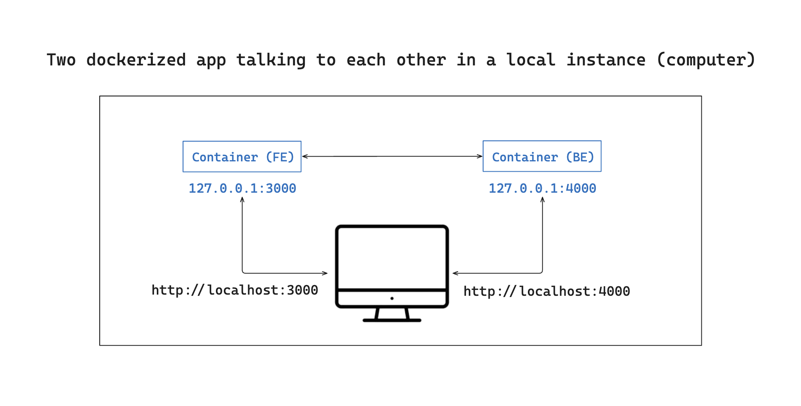
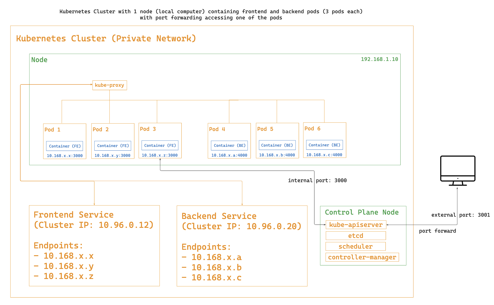
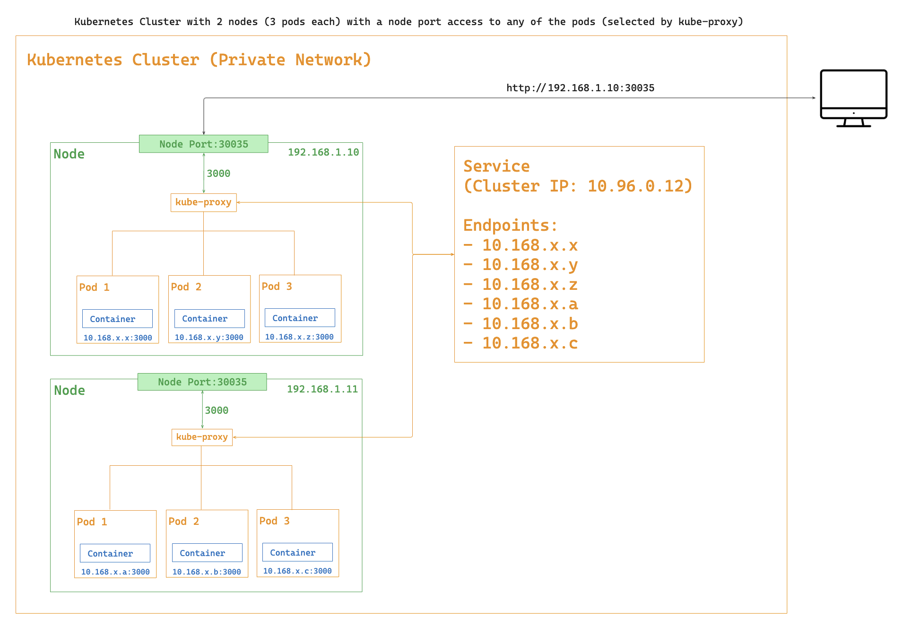
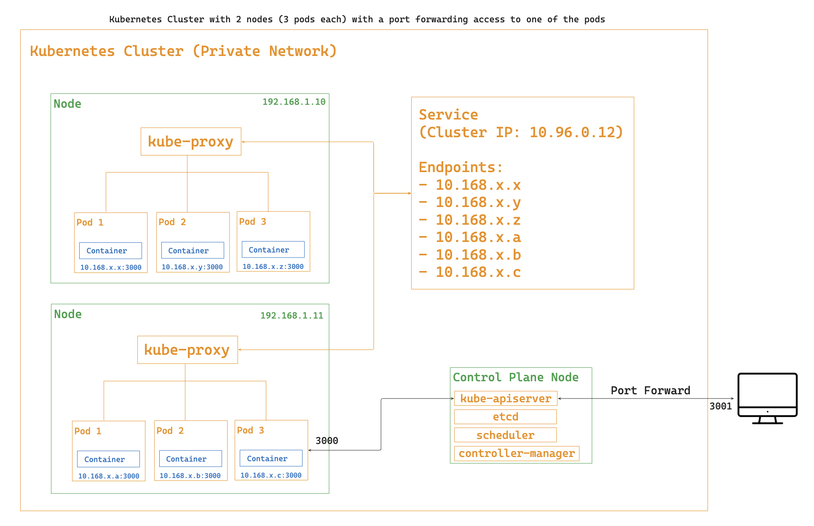

_Caption: Two dockerized app talking to each other in a local instance (computer)._

_Caption: Kubernetes cluster with 1 node (local computer), running 3 frontend and 3 backend pods, using port forwarding to access one pod._

_Caption: Kubernetes cluster with 1 node, running 3 frontend and 3 backend pods, with two node ports for accessing both frontend and backend pods._

_Caption: Kubernetes cluster with 2 nodes (3 pods each), accessed via port forwarding to one of the pods._

_Caption: Kubernetes cluster with 2 nodes (3 pods each), accessed via node port, with kube-proxy selecting the pod._
